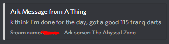
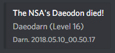
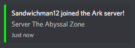
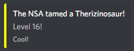

# ArkBot-3
A Discord bot for Ark: Survival Evolved server owners.
This bot supports a whole lot of features.

### Server Chat
You can send messages to and from the Ark server.

### Death Messages
You'll get notified if something dies. This includes tamed dinos or players.

### Player Leave/Join
A message will be put in chat if a player leaves or joins a server.

### New Tames
A message will be put in chat if a tribe tames a new dino. This can be disabled in the future.

